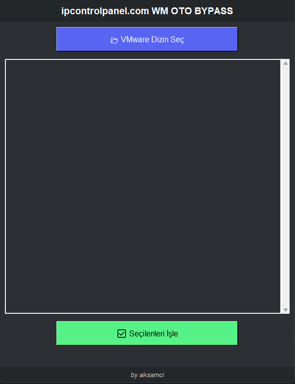

# 🛡️ WM Oto Bypass Tool

VMware sanal makinelerinin `.vmx` dosyalarına hızlıca anti-detection bypass kodları ekleyen, GUI tabanlı otomasyon aracı.


---

## 📚 Proje Hakkında

**WM Oto Bypass Tool**, VMware Workstation üzerinde kurulu sanal makinelerin `.vmx` dosyalarına sistemin sanal makine üzerinde çalıştığını tespit etmesini önlemek için **bypass kodları** ekler.

🖥️ Özellikleri:
- VMware klasörünü seçersiniz, içindeki tüm `.vmx` dosyalarını listeler.
- İstediğiniz `.vmx` dosyalarını seçersiniz.
- Seçili `.vmx` dosyalarına tespit önleyici **hypervisor**, **SMBIOS** gibi bypass ayarlarını **otomatik ekler**.
- Eğer bypass kodu zaten varsa dosyaya **tekrar eklemez**.
- Modern **karanlık tema** GUI.

> ⚡ **Farkı:**  
> Kod dosyaya enjekte edilir, sistemin VMware üzerinde çalıştığını gizler.

---

## 🚀 Özellikler

- ✅ Çoklu `.vmx` dosya desteği
- ✅ Önceden eklenmiş kodları atlama (tekrar eklemez)
- ✅ GUI tabanlı seçim ve işlem yapma
- ✅ VMware tespitini (anti-VM detection) önleyici kod ekleme
- ✅ Basit ve hızlı kullanım
- ✅ Karanlık tema
- ✅ .exe olarak paketlenmeye uygun (tkinter ve icon desteği var)

---

## 📜 Eklenen Bypass Kodları

```txt
hypervisor.cpuid.v0 = "FALSE"
board-id.reflectHost = "TRUE"
hw.model.reflectHost = "TRUE"
serialNumber.reflectHost = "TRUE"
smbios.reflectHost = "TRUE"
SMBIOS.noOEMStrings = "TRUE"
isolation.tools.getPtrLocation.disable = "TRUE"
isolation.tools.setPtrLocation.disable = "TRUE"
isolation.tools.setVersion.disable = "TRUE"
isolation.tools.getVersion.disable = "TRUE"
monitor_control.disable_directexec = "TRUE"
monitor_control.disable_chksimd = "TRUE"
monitor_control.disable_ntreloc = "TRUE"
monitor_control.disable_selfmod = "TRUE"
monitor_control.disable_reloc = "TRUE"
monitor_control.disable_btinout = "TRUE"
monitor_control.disable_btmemspace = "TRUE"
monitor_control.disable_btpriv = "TRUE"
monitor_control.disable_btseg = "TRUE"
monitor_control.restrict_backdoor = "TRUE"
scsi0:0.productID = ""
scsi0:0.vendorID = ""
```

> 💡 Bunlar, çoğu **anti-VM detection** yöntemini **bypass** eder.

---

## 🛠️ Kurulum


Gereken Python paketlerini yükleyin:

```bash
pip install -r requirements.txt
```

> **Not:** Tkinter ve standart kütüphaneler Python ile gelir, ekstra kurulum gerekmez.

---

## ⚡ Kullanım

Uygulamayı çalıştırmak için:

```bash
python wm_oto_bypass.py
```

GUI üzerinden:

1. **VMware Dizin Seç** butonuna tıklayın.
2. `.vmx` dosyaları listelenir.
3. Eklemek istediğiniz VMX dosyalarını seçin.
4. **Seçilenleri İşle** butonuna tıklayın.
5. Seçilen VM'lerin `.vmx` dosyalarına bypass kodları eklenecektir.

---

## 📷 Ekran Görüntüsü



> Uygulamanın çalışır halini gösteren ekran görüntüsü.

---

## 📦 Gereksinimler

- Python 3.8 veya üzeri
- tkinter (Python ile birlikte gelir)
- sys, os (standart kütüphaneler)

✅ **Ekstra kütüphane yok**.

---

## 📌 Bilgilendirme

- Program sadece **Windows** sistemlerde çalışır.
- `.vmx` dosyalarına müdahale için yönetici yetkileri gerekebilir.
- VMware Workstation ortamına uygun tasarlanmıştır.
- `.ico` dosya desteği mevcuttur (ikona sahip .exe paketleme yapılabilir).

---

## 📝 Lisans

Bu proje [MIT License](LICENSE) ile lisanslanmıştır.

---

